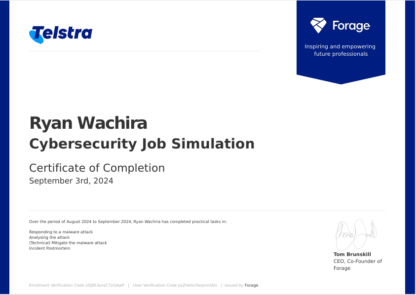

# Telstra Cybersecurity Virtual Internship

## Overview
This repository contains projects and tasks completed as part of the Telstra Cybersecurity Virtual Internship in August 2024. The internship provided a hands-on simulation of real-world cybersecurity challenges, where I served as an Information Security Analyst within Telstra's Security Operations Center (SOC).

## Table of Contents
- Overview
- Tasks Completed
  - Task 1: Responding to a Malware Attack
  - Task 2: Analyzing the Attack
  - Task 3: Mitigating the Malware Attack
  - Task 4: Incident Postmortem
- Skills Gained
- Conclusion
- Certification

## Tasks Completed

### Task 1: Responding to a Malware Attack
In this task, I identified and responded to a malware attack targeting Telstra's critical infrastructure. I triaged the alert, determined the severity, and notified the relevant teams for incident response.

**Key Actions**:
- Analyzed incoming firewall alerts to identify the affected infrastructure.
- Drafted and sent an incident notification to the appropriate teams.
- Documented the timeline and severity of the incident.

### Task 2: Analyzing the Attack
In this task, I analyzed the data from the malware attack to identify how the malware spreads and recognized patterns used by the attacker.

**Key Actions**:
- Examined firewall logs to identify attack patterns.
- Provided recommendations for creating a firewall rule to mitigate the attack.
- Drafted a technical report to the networks team outlining the findings.

### Task 3: Mitigating the Malware Attack
Here, I implemented a firewall rule using Python to technically mitigate the malware from spreading.

**Key Actions**:
- Developed a Python-based firewall rule to block malicious POST requests targeting vulnerable paths.
- Tested the rule using simulated attack scenarios to ensure its effectiveness.

### Task 4: Incident Postmortem
After resolving the incident, I created a detailed postmortem report to document the incident and the steps taken to mitigate it.

**Key Actions**:
- Conducted a root cause analysis of the malware attack.
- Documented the incident timeline, impact, and resolution.
- Provided actionable recommendations to prevent future incidents.

## Skills Gained
- **Malware Analysis**: Analyzed attack vectors and patterns, identified vulnerabilities, and mitigated threats.
- **Incident Response**: Managed the triage and resolution of a cybersecurity incident, ensuring swift and effective action.
- **Firewall Configuration**: Developed and implemented firewall rules using Python to block malicious traffic.
- **Post-Incident Review**: Conducted detailed postmortem analyses to document incidents and provide recommendations for future prevention.

## Conclusion
The Telstra Cybersecurity Virtual Internship allowed me to apply my knowledge in a real-world context, tackling complex cybersecurity challenges. This experience has strengthened my skills in incident response, threat analysis, and mitigation strategies, preparing me for future roles in cybersecurity.

## Certification
Here is the certificate of completion for the Telstra Cybersecurity Virtual Internship:

